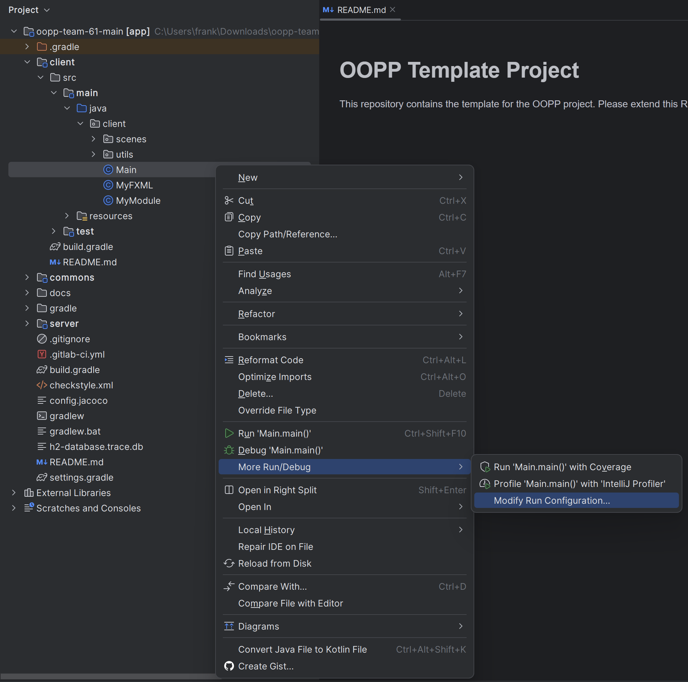
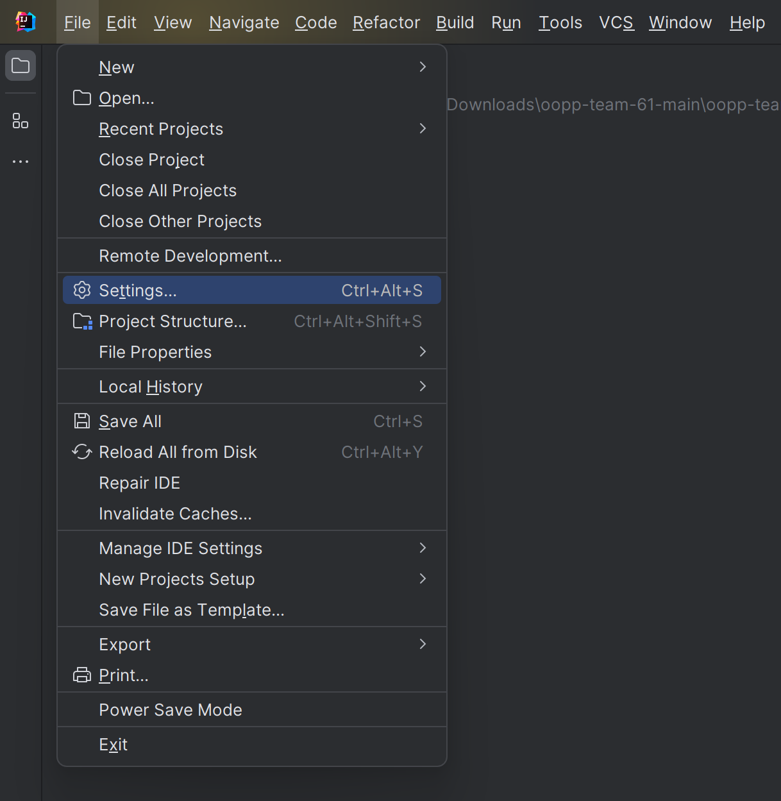
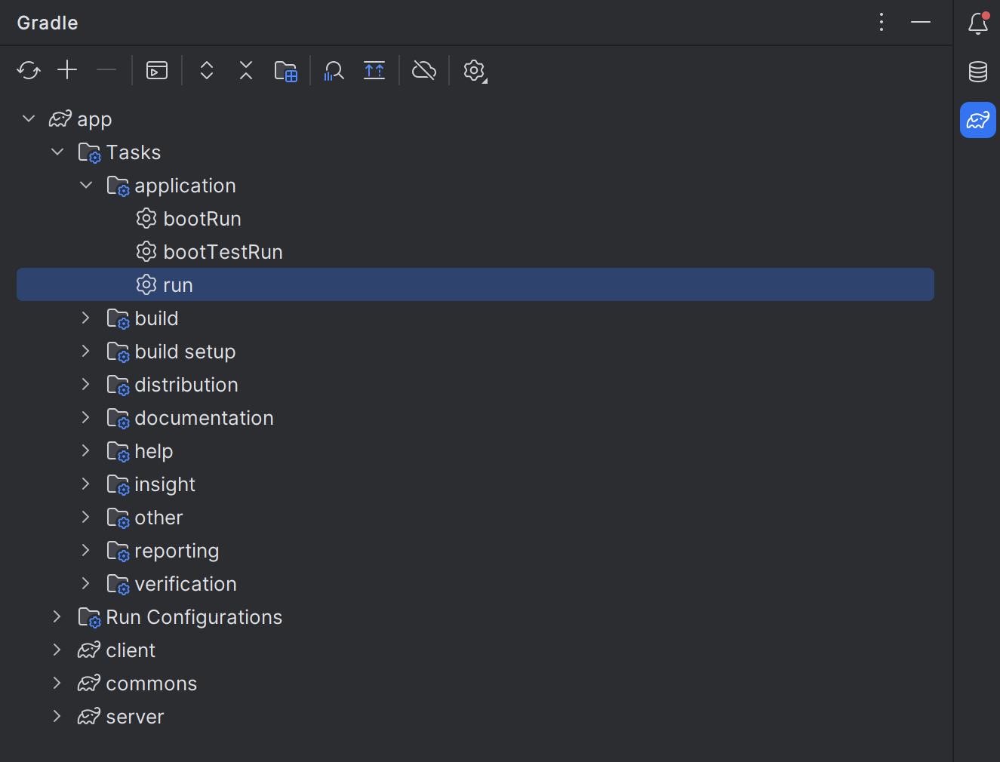

# OOPP Template Project

This repository contains the template for the OOPP project. Please extend this README.md with instructions on how to run your project.
# How to run the project
## Software prerequisites:
### How to install Java:
- Java 21(!) https://www.oracle.com/java/technologies/downloads/#java21
- Run java --version and check the output.
- Regardless of which Java JDK you have installed, Gradle will pick up the Java version
from your JAVA_HOME environment variable, so make sure it is set correctly
- Windows (Restart Required!)
https://superuser.com/questions/1057532/how-to-change-java-version-on-windows-10
- MacOS (use 21.0.2 instead of 17.0.1)
https://knasmueller.net/how-to-install-java-openjdk-17-on-macos-big-sur
### How to install JavaFX:
- https://openjfx.io/
- Download (SDK) (Match your Java JDK version)
- Unzip the downloaded SDK .zip somewhere (e.g., /path/to/javafx-sdk/)
- Make sure that this extracted path contains a “lib” folder
- Add VM Arguments to your Run Configs for the Client (note the “lib”!)
- To do this goto client/src/main/java/client and right click Main, click More Run/Debug and click Modify Run Configuration...

- This will Bring you to this menu

- For name put something like ClientMain and than press Modify options (blue link).
This will bring up a menu, select Add VM options from this menu.

- Once you have clicked this there will appear a new textfield VM options where you should put '--module-path="/path/to/javafx-sdk/lib" --add-modules=javafx.controls,javafx.fxml' 
- Make sure to change the /path/to/javafx-sdk/lib to the path of the unzipped javafx SDK and include /lib
- On Windows, you will like need to use backslashes (\) for the path
- Once you have filled this field in click apply and than click ok. If done correctly your configuration should appear in the top right of your screen.
- 

## Actually running the project: 

To Actually run the project follow these two simple steps:
- Go to server/src/main/java/server , rightclick Main and click Run 'Main'

This should start running the server and once you see the admin password in the console that opened up after a few second you can continue to the next step.

- Before running the client you should go to settings, Build, Execution, Deployment, Select Gradle and make sure the Gradle JVM is a jdk-21 (Make sure to click apply)

-Once you have done this you can go to the Gradle elephant icon on the right of your screen and click on app, Tasks, application, run.

- A new window has now opened with the application running!
- If you are using the standard server you can connect to it using localhost and the port 8080, have fun!